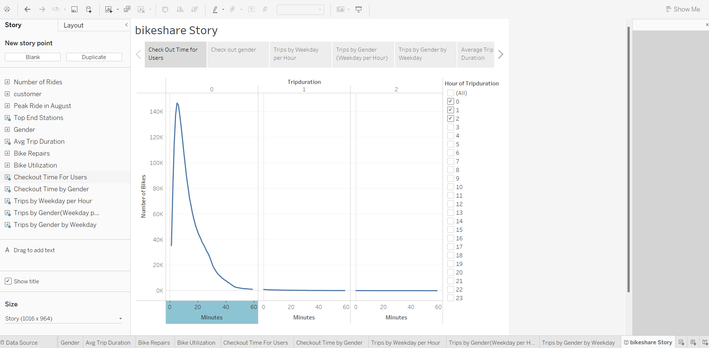
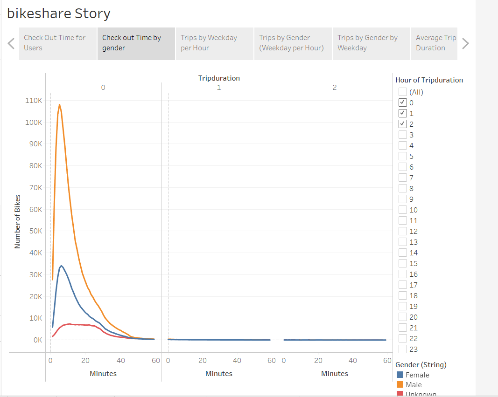
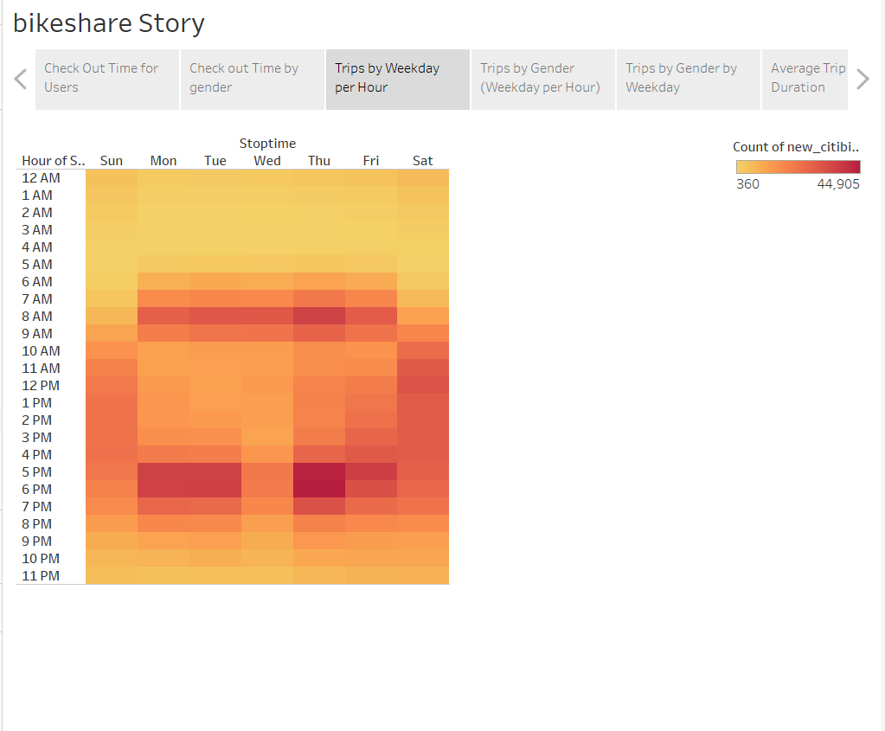
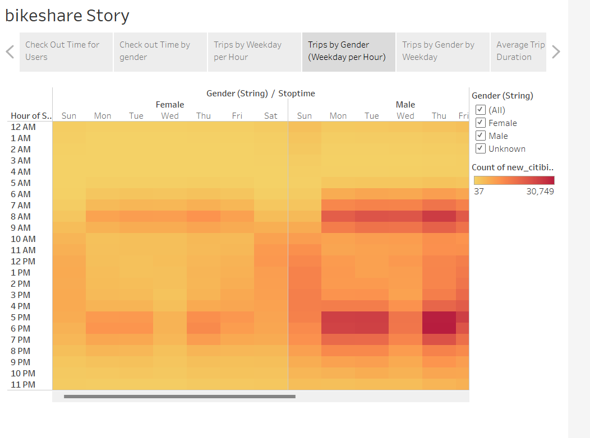
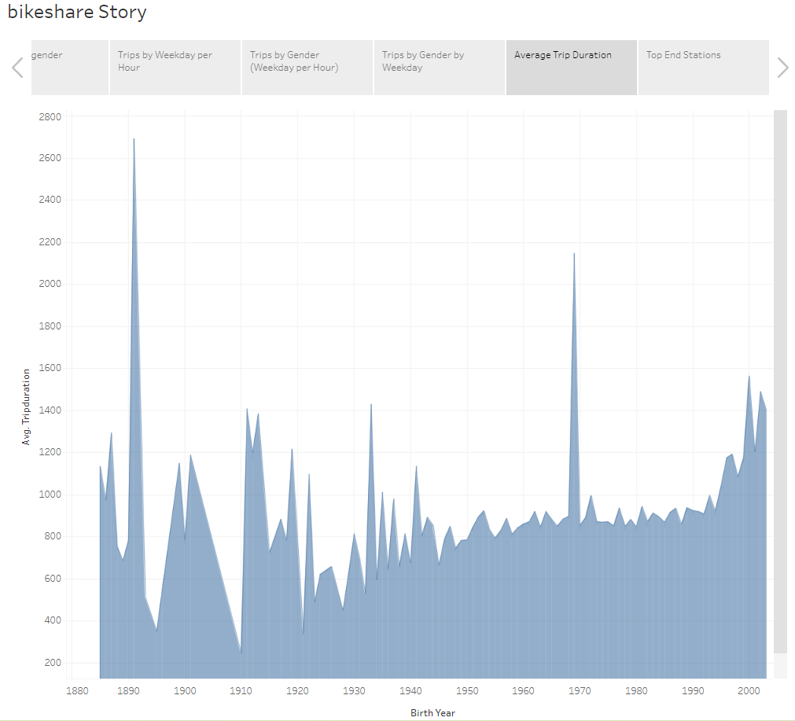
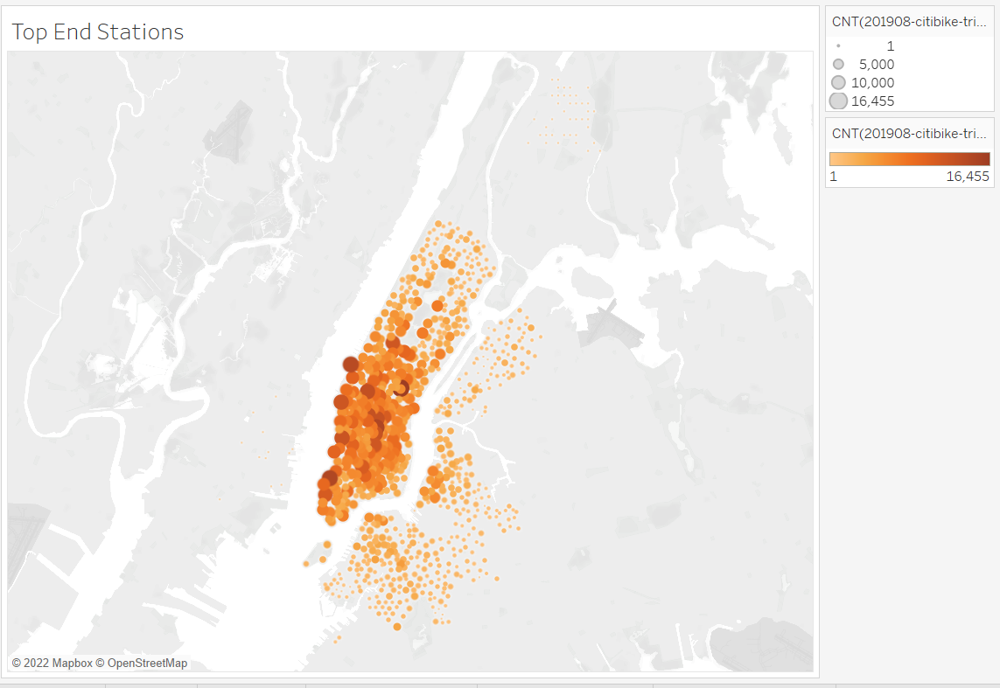

# bikesharing

### Overview of the statistical analysis:

In order to convince investors about a bike-sharing program in Des Moines is a good investment, we will analyze the trip characteristics, including:

- check out times for all riders and genders
- bike trips for each hour of each weekdays by gender
- bike trips for each weekdays by gender and by user type

### Results:

The results are summarized in the following charts:

- Checkout Time for Users:  it describes the trip durations.   We can see the majority bike trips are less than 20 minutes.

[link to Checkout Time for Users](https://public.tableau.com/app/profile/data.viz.2022/viz/bikesharing-checkout-time/CheckoutTimeForUsers?publish=yes)

- Checkout Time by Gender:  This graph shows the trip duration by genders.  The majority costumers are male.

  [link to Checkout Time by Gender](https://public.tableau.com/app/profile/data.viz.2022/viz/bikesharing-checkout-time-by-gender/CheckoutTimebyGender?publish=yes)

- Trips by Weekdays per Hour:  this graph shows the number of trips by weekdays per hour.  We can get the conclusion that the peak time is between 7am to 8 am in the morning and 5pm to 6 pm in the afternoon during weekdays.  

​	[link to Trips by Weekdays per Hour](https://public.tableau.com/app/profile/data.viz.2022/viz/bikesharing-TripsbyWeekdayperHour/TripsbyWeekdayperHour?publish=yes)

- Trips by Gender in Weekdays per Hour:  It shows the same trend of peak time by genders.

  [link to Trips by Gender in Weekdays per Hour](https://public.tableau.com/app/profile/data.viz.2022/viz/bikesharing-TripsbyGenderWeekdayperHour/TripsbyGenderWeekdayperHour2?publish=yes)

- Trips by Gender by Weekdays for customer type :  it shows most users are the male subscribers on the weekdays.

[link to Trips by Gender by Weekdays](https://public.tableau.com/app/profile/data.viz.2022/viz/bikesharing-TripsbyGenderbyWeekday/TripsbyGenderbyWeekday?publish=yes)

- Average Trip Duration by Age:  the 2 spikes at 1890 and 1970 need further investigation on the data accuracy. 

  [link Average Trip Duration by Age](https://public.tableau.com/app/profile/data.viz.2022/viz/bikesharing-AverageTripDurationbyAge/AvgTripDuration?publish=yes)

  

- Top End Stations:  this graph shows the top end stations.

  [link of Top End Stations](https://public.tableau.com/app/profile/data.viz.2022/viz/bikesharing_16626810023040/TopStartStations)

#### Summary:

These seven (7) graphs show us that the bike sharing business is sustainable.  There are needs for short distance traveling and for visiting or exercising in the city.  We can add two additional graph for future:

- most popular starting station:  we will use this data to deploy more bikes at these locations;
- user type for the trip duration:  we will use this data to attract more subscribers.

